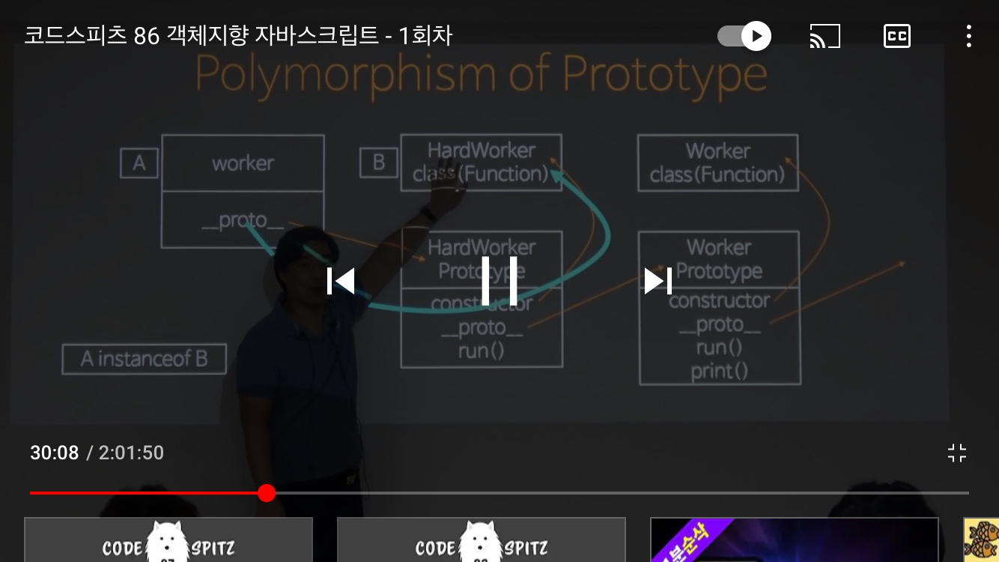

# OOP와 객체지향언어

---

<aside>
📌 기능분해(알고리즘 분해)- 하향식 설계의 경우, 기능을 기준으로 분해하게되는데, 문제는 
클라이언트의 요구사항은 언제나 변화하고 이런 하향식 설계는 변화에 취약해질수 밖에없다는 점이다. 따라서 우리는 변화에 유연하게 대처하여야 한다. 
이에 따라 데이터를 기준으로 분해하게 되고, OOP과 같은 설계 기법이 탄생하게 되었다.

</aside>

---

### Value  vs Identifier

- Value 
- 값을 복사하여 비교 및 파라미터로 입력, 
- 복사하여, 전달하기 때문에, 상태변화에 안전(강제) 연산을 기반으로 로직을 전개 하게 된다.
- Identifier 
- 그와 반대로, 참조하여 비교 하기 때문에 원본의 상태변화에 반응한다.

<aside>
📌 기본적으로 value는 함수형프로그래밍언어 / Identifier 객체지향언어로 
각 언어의 디자인에 맞게 Value or Identifer 참조하여 설계해야한다.

</aside>

---

### 객체에 대한 정의

- 캡슐화 ( Function에 대한 은닉) 
→ 데이터기준으로는 은닉 있지만, 메서드에 대하여 캡슐화가 있다.
→ 캡슐화는 메서드를 추상화하여, 메서드 내부의 정보를 은닉
- 상태 은닉 및 유지
→ get/set 은 의미 없음 
→ 오로지 메세지를 통해 내부(const/final과 같이) 변수에 대해 컨트롤

---

### OOP와 Polymorphism의 만족

- OOP와 관련되어 많은 특징이 존재하지만 무엇보다 다형성(Polymorphism)이 만족되고 지켜져야 한다.
- Polymorphism
- 대체가능성 → 부모(루트개체)의 역할을 자식(확장된 개체)이 대체 할 수 있다.
- 내적일관성 → 생성 시점의 타입이 내부에 일관성있게 참조되어진다.

```jsx
const Worker = class{run()...print(
	this.run();
)}
const HardWorker = class extends Worker{run()..}
const worker = new HardWorker()
console.log(worker instanceof Worker) // True 대체가능성 
worker.print()
// worker는 HardWorker이므로, HardWorker의 run()메서드가 실행된다. 내적동질성 
```

---

### 자바스크립트에서의 다형성의 만족

→ 자바스크립트는 객체지향언어이기도 하지만, 프로토타입 언어.

HardWorker class를 만들 때 기본적으로 ProtoType속성이 생성되어 진다.

worker의 __proto__속성은 HardWorker클래스의 ProtoType 속성을 바라보게 된다.

프로토타입속성은 run과 같은 함수 뿐 아니라, constructor / __proto__ 속성을 가지고 있고 이때의

__proto__속성은 부모클래스인 Worker클래스의 ProtoType을 바라보고 있다.

이렇게 __proto__속성과 참조되고 있는 ProtoType 클래스를 추적하여 체이닝하며, 가지고 있는 메서드나 속성을 호출할 수  있게 된다.



---