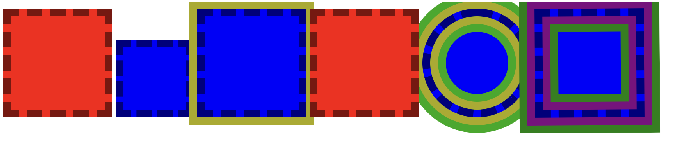

# [76장 Css Rendering]

### MordenBox

- BOX_SHADOW
    - 보더박스 바깥쪽으로 Box_Shadow가 존재해서 계속해서 추가해서 그릴 수 있다.
    - OUTLINE이 존재하며, 박스쉐도우와 마찬가지로 크기를 잡아먹지 않는 지오메트리의 영역에 영향을 주지 않는다.
    - Border - radius에 따라 박스쉐도우도 동일하게 영역을 잡는다.
- BOX_SHADOW INSET

```html
<style>
div{width:100px;height:100px; padding:10px; border:10px solid #000;display:inline-block}
</style>
<div style="background:blue; box-sizing:border-box"></div>
<div style="background:blue; box-shadow:0 0 0 10px #aa0"></div>	
<!-- 그림.1 인라인요소임에도 불구하고 그려지는데 순서가 존재합니다. z-index처럼 생각해볼 수 있다.-->
<div style="background:red; position:relative"></div>
<!-- relative옵션은 노말플로우를 다 그린 후에 상대위치를 계산해서 그리기 때문에 덫그린다. -->
<div style="background:red; box-shadow: inset 0 0 0 10px rgba(255,255,0,1)"></div>
<!-- inset 옵션으로 보더박스 안쪽에 그려진다. -->
<div style="background:blue;
	box-shadow:
		0 0 0 10px #aa0,
		0 0 0 20px #0a0,
		inset 0 0 0 10px #aa0,
		inset 0 0 0 20px #0a0;
	border-radius:50%"></div>
<!-- box-shadow에 선언된 역순으로 스택에 쌓이면서 그려진다. -->
@keyframes any{
	from{ transfrom : rotate(0); box-shadow: 0 0 0 0 purple, 0 0 0 0 green, inset 0 0 0 0 purple, inset 0 0 0 green}
	to{box-shadow: transform:rotate(360deg)0 0 0 10px purple, 0 0 0 20px green, inset 0 0 0 10px purple, inset 0 0 0 20px green}
}
<div style="background:blue;animation:ani 0.4s linear alternate infinite"></div>

```



그림-1

```html
<div style="
	background:brown
	border-radius : 15px;
	outline : 10px solid brown;
	border : 1px dashed #fff;
	color : #fff;
	box-shadow : 0 0 0 10px brown
">stitched Pattern</div>
<!-- 박스 쉐도우는 레디우스를 따라가고 아웃라인은 따라지 않음을 이용한 스티치 패턴 -->

```

### Position

- STATIC | RELATIVE | ABSOLUTE | FIXED
    - CARET POSITION & OFFSET
        - OFFSET : 변경 불가능한 읽기전용 속성. (계산되어 도출된 값)
        - OFFSET PARENT : 실제로 계산될 기준
            1. NULL
                - ROOT,HTML, BODY
                - POSITION : FIXED
                - OUT OF DOM TREE
            2. RECURSIVE SEARCH
                - PARENT.POSITION:FIXED. =NULL
                - ***PARENT.POSITION:!STATIC  = OK (* Relative와 Absolute 일때 )***
                    - static 내에서 position absolute을 사용할 때 relative로 감싸주어야 한다.
                - BODY = OK
                - TD, TH , TABLE = OK
                - PARENT.PARENT CONTINUE
        - OFFSET VALUE : offsetLeft, offsetTop, offsetWidth, offsetHeight, oppsetScrollTop…
            - offsetScrollWidth, offsetScrollHeight → 실제 Content의 크기

```html
<div style="width:200px; height:200px; background:yellow; margin:100px;">
	<div style="width:100px; height:100px; position:acsolute; background:red"></div>
	<div style="width:100px; height:100px; position:acsolute; background:blue; left:0"></div>
</div>
<!-- dom상에 부모(OffsetParent)의 기본값을 기준으로 offset 을 잡게 된다. -->
<!-- left, top 등 offset은 다음과 같이 position에 따라 다르게 계산된다. -->
<!-- top, left는 OffsetParent를 기준으로 계산하는 속성 -->
<!-- relative일때의 offset은 normarl flow로 그려졌을때 차이값 -->
<!-- static일때는 offset은 무시합니다. -->

	
```

###