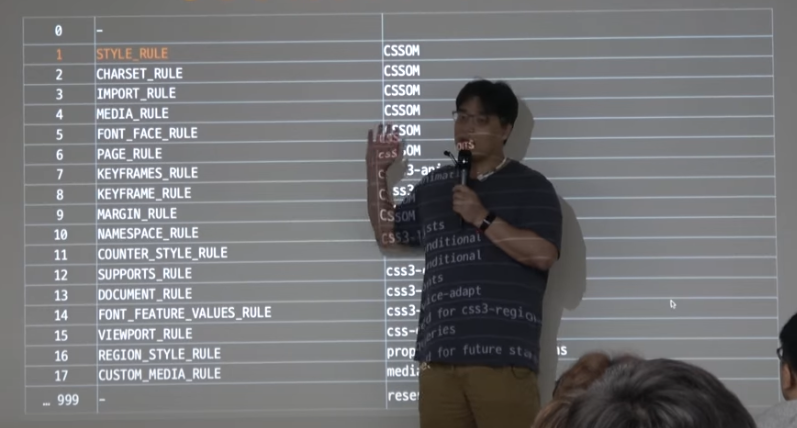

# [CSS RENDER 3강]

```html
<script>
	const el = document.querySelector("#s");
	const sheet = el.sheet;
</script>
```

### CSS OBJECT MODEL

- SHEET
    - CSSROULES : CSSRULE LIST
    - `const rules = sheet.cssRules`  유사 배열을 가져올 수 있음.
    - List 내부에는 하나하나의 Item들이 존재(Rule)
    - 하나의 CSS 정의가 하나의 Item, 즉 Rule로 정의 된다.
    - Rule은 Type , SelectorText and StyleObject가 존재(돔에도 들어있지만, 룰에도 존재)
    - CSSRULE_TYPE(참고)
        
        
        
    - 동적 InsertRule
        - sheet에 직접 추가도 가능
        
        ```jsx
        const sheet = el.sheet;
        const rules = sheet.cssRules;
        
        document.querySelector('.red').onclick=_=>{
        	sheet.insertRule('.red{background:red}',rules.length);
        	sheet.insertRule('.blue{background:blue}',rules.length);
        	
        }
        //순서로 인한 CSS가 우선순위로 나누어져 적용
        document.querySelector('.blue').onclick=_=>{
        	sheet.deleteRule(rules.length-1); //blue style deleted	
        }
        ```
        
    - `document.styleSheets`  내부 스타일 시트를 전부 확인할 수 있다.
        - `disable` 속성을 False를 줄수도있다.
    
    <aside>
    💡 이제부터 본격적으로 CSS sheet를 조작합니다.
    
    </aside>
    
    ---
    

# Compatibility Library

### Vender PREFIX

- Runtime Fetch

### UNSUPPORTED PROPERTY

- 브라우저 마다 지원하지 않는 속성이 존재.

### Hierarchy Optimaze

- `Sheet.disabled = True;`
- css의 중첩된 계산을 방지 → sheet에 몰아두고 disabled

---

### Classes

- STYLE(CSSStyleDeclare) → RULE (CSSRule)→ CSS(StyleSheet)

```jsx
const Style=(_=>{
	const prop = new Map, prefix = 'webkit,moz,ms,chrome,o,khtml'.split(',');
	const NONE = Symbol();
	const BASE = document.body.style;
	const getKey = key =>{
		if(prop.has(key)) return prop.get(key);//prop 캐시 저장
		if(key in BASE) prop.set(key,key);
		else if(!prefix.some(v=>{
			//프리픽스 존재 여부 체크
			const newKey = v +key[0].toUpperCase() + key.substr(1);//webkitBackground -> newkey
			if(newKey in BASE){
				prop.set(key,newKey);
				key = newkey;
				return true;
			}else{return false;}
		})){
			prop.set(key,NONE);
			key = NONE; //마지막 전략으로 해당 키는 없는 값으로 설정
		}
		return key;
	}
	return class{
		constructor(style){this._style = style;}
		get(key){
			key =getKey(key);
			if(key=== NONE) return null;
			return this._style[key];
		}
		set(key,val){
			key =get(key);
			if(key !== NONE) this._style[key] = val;//없으면 건드리지 않음(graceful fail)
			return this;
		}
	}
})();//vender prefix를 조사해서 런타임에서 적용하는 밴더프리픽스
//UNSUPPORTED PROPERTY - GRACEFUL FAIL 브라우저 대응

const style = new Style(rule.style);
style.set('borderRadius','20px').set('boxShadow','0 0 0 10px red'); //metho chainning

```

### Rule

```jsx
const Rule = class{
	constructor(rule){
		this._rule = rule;
		this._style = new Style(rule.style); 
	}
}
const rule = new Rule(rules[0]);
rule.set('borderRadius', '20px').set('boxShadow', '0 0 0 10px red');
```

### Sheet

```jsx
const Sheet = class{
	constructor(sheet){
		this._sheet = sheet
		this._rules = new Map;
	}
	add(selector){
		const index = this._sheet.cssRules.length;
		this._sheet.insertRule('${selector}{}',index);
		const cssRule = this._sheet.cssRules[index];
		const rule = new Rule(cssRule)
		this._rule.set(selector , rule);
		return rule;
	}
	remove(selector){
		if(!this._rules.contains(selector)) return;
		const rule = this._rules.get(seletor)._rule;
		Array.from(this._sheet.cssRules).some((cssRule,index)=>{
			if(cssRule === rule._rule){
				this._sheet.deleteRule(index);
				return true;
			}
		}
	}
	get(seletor){return this._rules.get(seletor);}}
}
```

---

```jsx
const sheet = new Sheet(document.styleSheet[1]);
sheet.add('body').set('background','#f00');
sheet.add('.test').set('cssText','
		width:200px;
		border:1px solid #fff;
		color : #000;
		background : #fff;
'); 
```

- 복잡한 css 오브젝트를 여러가지로 다룰 수 있는 방법에 대해 생각해보았다.
- dom하나하나 다루는것보다 더 쉽게 편리하게 cssObject를 가깝게 다룰 수있다.

---

### KEYFRAMES_RULE COVER

- 어떻게 구현되는지 공부한다.

```css
/* 키프레임 셀렉터를 어떻게 객체화 하고 다루는지 공부한다. */
@keyframs size{
	from{width:0}
	to{width:500px}
}
```

```jsx
const sheet = new Sheet(document.styleSheets[1]);
sheet.add('@keyframes size').set(???);
//어떤 룰을 줄지는 sheet가 결정한다.
//기존 Sheet 클래스에서 분기

const Sheet = class{
	constructor(sheet){
		this._sheet = sheet
		this._rules = new Map;
	}
	add(selector){
		const index = this._sheet.cssRules.length;
		this._sheet.insertRule('${selector}{}',index);
		const cssRule = this._sheet.cssRules[index];
		let rule;
		if(selector.startsWith('@keyframes')){
			rule = new KeyFramesRule(cssRule);
		}else{
			rule = new Rule(cssRule)		
		}
		
		this._rule.set(selector , rule);
		return rule;
	}
	remove(selector){
		if(!this._rules.contains(selector)) return;
		const rule = this._rules.get(seletor)._rule;
		Array.from(this._sheet.cssRules).some((cssRule,index)=>{
			if(cssRule === rule._rule){
				this._sheet.deleteRule(index);
				return true;
			}
		}
	}
	get(seletor){return this._rules.get(seletor);}}
}
```

```jsx
const KeyFrameRule = class{
//Sheet객체와 비슷하다 내부에 스타일 객체처럼 생겼음
//insertRule 을 appendRule로 바뀐것 외엔 크게 다르지 않다.
	constructor(rule){...}
	add(selector){...}
	remove(selector){...}
}
const sheet = new Sheet(document.styleSheets[1]);
const size =sheet.add('@keyframes size');
size.add('from').set('width','0');
size.add('to').set('width','500px');
//keyframes 애니메이션을 동적으로 정의해서 쓸 수 있음.
```

---

### 차세대 Typed CSSOM (오브젝트 모델링)

```jsx
$('#someDiv').style.height = 5 +'px';
//다음과 같이 타입에대한 파싱 알고리즘이 돌아간다.
$('#someDiv').styleMap.get('height');
$('#someDiv').styleMap.set('height',h);//값으로 전달
CSS.px(500); //500px
```