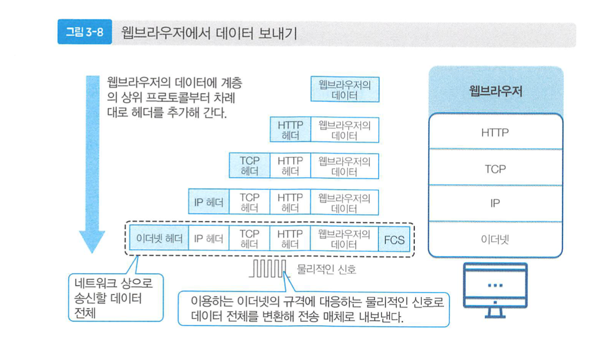
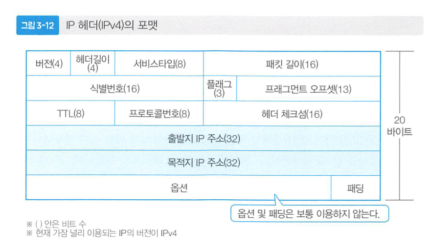
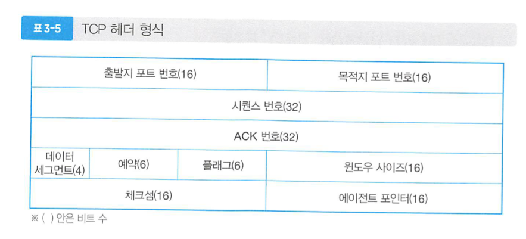

# [3장] 네트워크 계층

1. 네트워크 인터페이스층
    - 0,1의 디지털데이터를 전기신호 등의 물리적 신호로 변환해 전송매체로 전달합니다.
    - 스위치 L2와 같이 물리적 인터페이스를 담당하며, 이더넷 헤더를 보고 데이터를 처리합니다.
2. 인터넷층
    - 라우터를 통해 네트워크간의 전송(라우팅), 출발지와 목적지 사이의 데이터전송(엔드투엔드).
    - 라우터나 L3스위치가 IP헤더를 참조하여 데이터를 처리합니다.
    - IP, ICMP, ARP 등
3. 트렌스포트층
    - 엔드투엔드 전송에서의 신뢰성을 제공 (TCP)
    - 데이터의 순서, 흐름, 분할 및 조립 기능 제공
4. 애플리케이션층
    - 전송되어진 데이터를 인간이 인식할 수 있는 데이터로 가공, 표현
    - HTTP, SMTP, POP3, DHCP, DNS

---

### 계층별 데이터 호칭

- 애플리케이션 : 메세지
- 트렌스포트층 : 세그먼트, or 데이터그램
- 인터넷층 : 패킷
- 네트워크층 : 프레임

> 각 데이터의 호칭을 보고 어느 계층에서 작동하는지 알 수 있어야 합니다.
> 

---

---

### 데이터의 전송

- 유니캐스트 - 단 한곳으로 데이터 전송.
- 브로드캐스트 - 같은네트워크상 호스트들에게 전송
    - `255.255.255.255`
- 멀티캐스트 - 멀티캐스트 그룹에 등록된 호스트에게 전송

---

### IP는 확인하지 않는다.

- 최선형 이라는 특징을 가짐, 데이터 도착을 보장하지 않음.
- ICMP라는 프로토콜이 개발되어 데이터 도착을 보장
- ARP : IP주소의 MAC 주소를 질의하는 프로토콜

---

### TCP

- 신뢰성있는 데이터전송을 보장하는 프로토콜
- 3way-handshake
- 시퀀스와 ack번호를 통해 데이터의 흐름제어한다.

