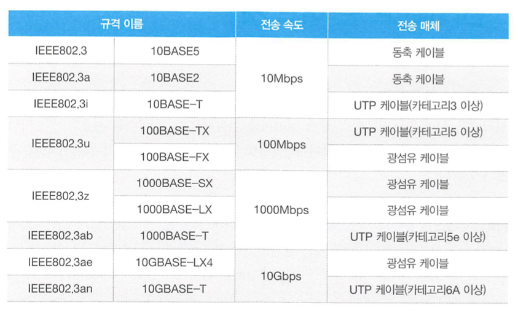
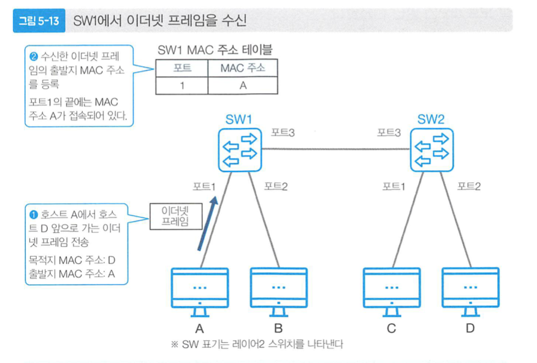

# [5장] 이더넷과 무선LAN

### 개요

- L2 스위치와 같은 기본 네트워크 구성에서, 라우터 혹은 L3스위치로 각 네트워크를 연결합니다.
- 이 과정에서 자주 사용되는 이더넷과 무선 LAN(WIFI)에 대해서 공부합니다.

---

### 이더넷

- 이더넷은 가장 아래층인 네트워크 인터페이스 계층으로, L2 스위치를 사용합니다.
- 같은 이더넷 사이에서는 같은 인터페이스를 사용하며 L2 스위치 내 데이터를 전송할 수 있습니다.
- 규격(참고)

- 다양한 규격이 있지만 가장 많이 사용되는 ***RJ-45 이더넷 인터페이스와 UTP 케이블***
    - UTP 케이블은 수신과 송신을 나눈 총 4개의 조로 이루어진 전이중 통신 매체 입니다.
- 데이터의 형식
    - 이더넷 프레임 = 헤더 + 데이터 + FCS(에러 컨트롤)
    - 헤더 = 목적지 MAC주소 + 출발지 MAC주소 + 타입코드

---

### 단일 매체 전송 제어

- 초기 버스형 토폴로지에서는 단일 매체로 ,, 단하나의 클라이언트에서만 데이터 전송이 가능했다.
- 따라서, 언제 어떻게 데이터를 보낼지에 대한 프로토콜이 필요했습니다.
    - CSMA - 말하기 전 듣기 매커니즘으로 데이터 전송전에 전송매체를 체크해보는 프로토콜로, 충돌에 대한 탐지가 불가능하다는 한계가 있다.
    - CSMA/CD - Collision Detection 으로, 전압의 변화로 충돌을 탐지할 수 있고, jamming signal을 보낸 뒤, 랜덤시간 뒤 재전송하는 프로토콜입니다.
    - CSMA/CA  - 무선 네트워크 환경에서 CD 프로토콜을 사용할 수 없어 Collision Avoidance  프로토콜이 개발되었습니다.

> 단, 현재는 CSMA/CD 할 필요없이 데이터를 전송합니다.
> 

---

### SW2의 동작

- A에서 D로 이더넷프레임을 전송하게 되면, SW1은 요청을 받아 헤더를 보고 출발지 MAC주소,즉 PORT1에 A 호스트의 MAC 주소를 MAC 주소 테이블에 적게 됩니다.
    
    
    
- 그리고 목적지 MAC주소가 등록되어 있지 않으니 Unknown 유니캐스트 프레임으로 처리하는데 이 때 수신한 포트를 제외한 모든 포트에 전송하게 됩니다. 이를 `플러딩` 이라고 합니다.
- B는 데이터를 받되, 본인의 맥주소와 다르므로 파기시킵니다.
- SW2는 SW1과 똑같이 헤더의 출발지 MAC주소를 보고 MAC주소 테이블에 포트3 , 호스트 A의 주소를 적어둡니다.
- 이 후 마찬가지로 MAC주소테이블에 D호스트의 맥주소가 없으므로 `Unknown 유니캐스트 프레임` 으로 `플러딩` 합니다.
- C는 본인의 맥주소가 아니므로 파기.
- D는 데이터를 상위 프로토콜에서 처리를 수행합니다.
- D의 응답은 마찬가지로 SW2에 D의 출발지 MAC주소를 주소테이블에 등록하고, A호스트의 MAC주소가 PORT3에 있는 것을 확인하여 PORT3으로 전송, SW1 또한 마찬가지로 PORT1에 MAC주소가 등록된것을 확인하여 전달합니다.

> 이렇듯, MAC 주소를 계속 등록해가며 전송합니다. 또 별다른 설정없이 PC와 연결되어있으면, L2스위치는 동작할 수 있습니다.
> 

<aside>
📌 하나의 포트에 다수의 MAC주소가 등록될 수 있으며, 대략 5분단위로 제한시간을 설정하게 됩니다.

</aside>

---