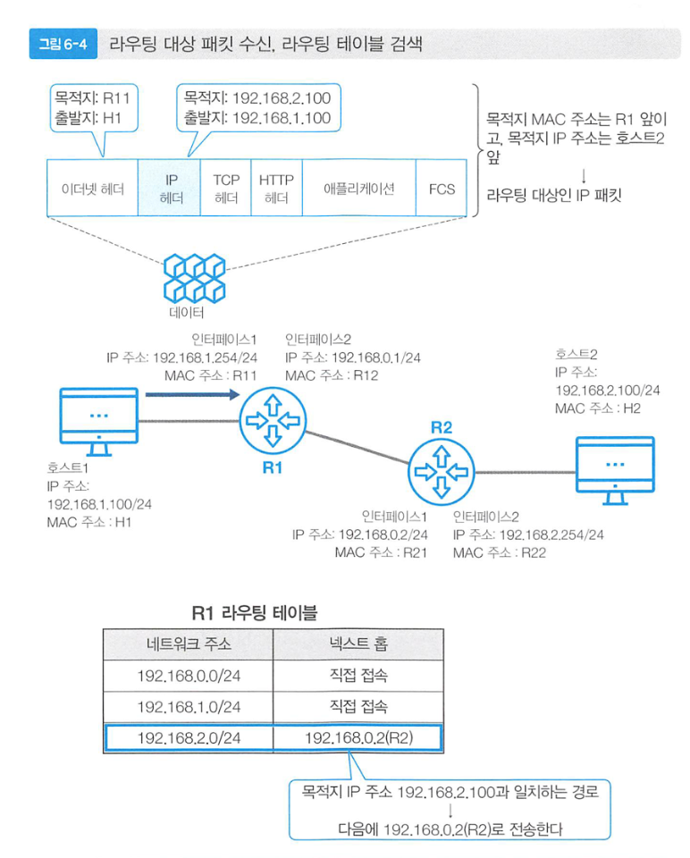
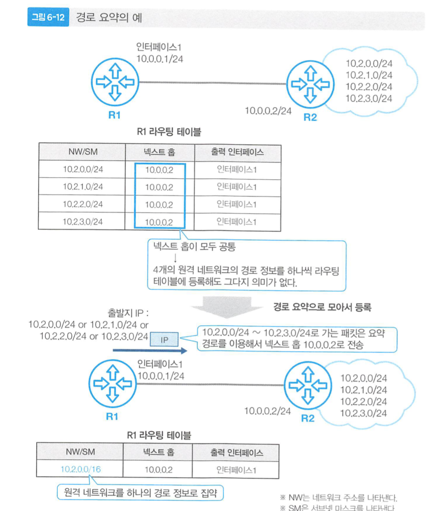
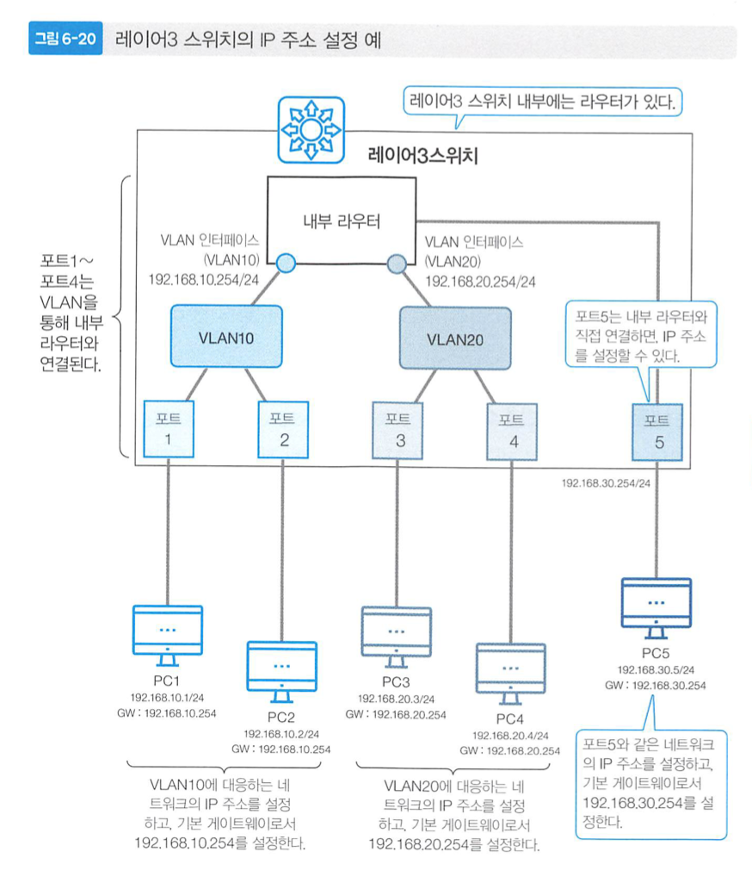
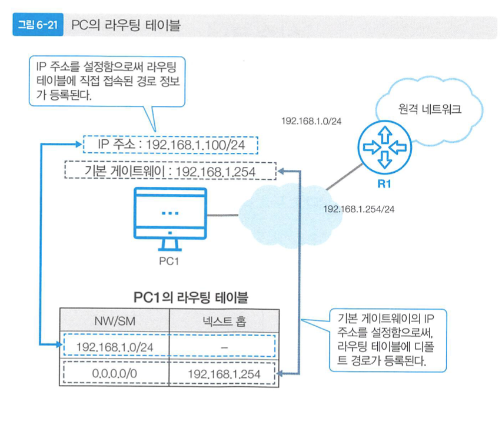

# [6장] 라우터

- 다른 네트워크에 데이터를 보낼 때, 네트워크를 서로 연결하는 라우터를 사용한다.
- 라우터는 IP패킷이라는 데이터를 전송하며,IP패킷 중 헤더는 목적지 IP외에도 TTL, 체크섬 값을 가지고 있습니다.
    - 단, 이더넷 헤더의 경우 네트워크 인터페이스층의 라우터를 경유하면서 새로운 헤더로 교체됩니다.
- 다른 네트워크를 연결하기 위해, 라우터의 인터페이스에 IP 주소를 설정합니다.

---

### 라우터 데이터 흐름

- 이더넷 헤더는 라우터를 만날때마다 계속해서 바뀌며, IP헤더는 변경되지 않는다.(단 TTL, 체크섬 제외)
- 목적지 IP 주소를 보고  R1의 라우팅테이블을 참조해, `192.168.2.0/24` 주소의 넥스트홉으로 연결해준다.
- ***이 때 이더넷 헤더를 교체하기 위해 목적지의 맥주소를 알기위해 ARP를 통해서 다음 라우터의 맥주소를 알아와 이더넷 헤더의 목적지에 적어준다.***
- IP헤더를 통해서 라우팅 테이블을 참조해, 라우팅하며 라우팅 테이블의 정보는 RIP을 통해서 입력된다.

---

### 라우팅 테이블

- 어떤 네트워크로 IP패킷을 전송할 것인지 등록되어있는 테이블
- 테이블 내부의 경로는 루트 정보 혹은 경로 정보로 부릅니다.
- 방법
    1. 직접 접속 : 특별한 설정 없이 직접 접속을 통해 라우팅 테이블의 경로를 등록합니다.
    2. 스태틱 라우팅 : 라우터에 커맨드를 입력하는 방식으로 수동으로 라우팅 테이블을 등록합니다.
    3. RIP, OSPF,BGP 와 같은 라우팅 프로토콜을 사용해서 정보를 교환합니다.
        1. ARP의 경우엔 MAC주소를 얻기위해 사용하는 프로토콜
- 경로 요약
    - 모든 경로를 라우팅 테이블에 넣을 수 없으므로 서브넷 마스크를 이용해서 경로를 요약해서 테이블에 입력합니다.
    
    
    
    > 디폴트 경로 : `0.0.0.0/0` 과 같은 경로 정보로 모든 네트워크를 의미
    > 
    
    ---
    

### Layer 3 스위치

- L3스위치의 경우 라우팅 기능을 포함하고 있는 네트워크 기기 입니다.
- 같은 네트워크에서는 MAC주소를 기반으로, 다른 네트워크는 IP주소 기반으로 데이터를 전송
- VLAN으로 분할한 네트워크를 연결할 수 있음.
    - 스위치를 가지고 VLAN으로 2대의 스위치로 나눈 것처럼 활용할 수 있고 이는 데이터가 전송되는 범위를 제한할 수 있습니다.
    - 분할뿐만 아니라 복수의 VLAN을 만들 수도 있습니다.

> VLAN : 같은 VLAN을 할당받은 포트 사이에서만 이더넷 프레임을 전송할 수 있도록 구역화
> 
- VLAN을 연결하기 위해서는 L3 스위치 내부의 가상인터페이스에 IP주소를 설정합니다.

> PC에서의 라우팅 테이블
- 직접 IP주소와 게이트웨이를 입력해준다.
> 

