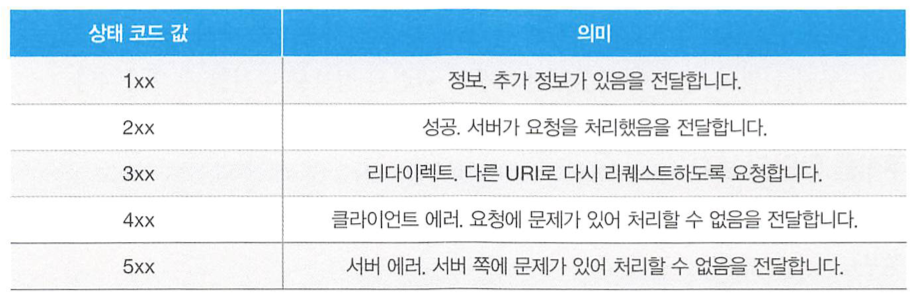

# [4장] 웹서버의 동작

### 개요

- 웹사이트는 웹브라우저에서의 파일전송 요청, 그리고 웹서버애플리케이션에서 파일로 응답 및 반환, 마지막으로 수신한 파일을 웹브라우저로 표시하는 과정을 그리고 있습니다.
- 각 과정은 네트워크인터페이스층(이더넷), 인터넷층(IP), 트랜스포트층(TCP), 애플리케이션층(HTTP)로 조합되어 있습니다.

---

### 내용

- URL : Uniform Resource Locator, 혹은 URI(Identifier)
    - URL의 형식
        - 스키마(프로토콜)://호스트명/경로명
- HTTP
    - HTML 파일뿐만 아니라 다양한 파일을 전송하기 위한 프로토콜로, 리퀘스트와 리스판스로 통신합니다.
    
    > 여기서 통신에 전송계층의 TCP를 사용하는데 3way handshake를 통해서 연결성을 가지고 신뢰성을 보장합니다.
    단, 이 연결은 응답이후 종료되는데, HTTP1.1 이후 `keep-alive`헤더옵션을 통해서 3wayhandshake를 유지하는
    > 
    - HTTP헤더는 리퀘스트 라인, 메세지 헤더, 공백라인으로 이루어져 있습니다.
    - 리퀘스트 라인 내 메소드:
        1. GET : URI 데이터 수신
        2. HEAD : URI 헤더 수신
        3. POST : 서버 데이터 전송
        4. PUT : 서버 파일 전송(혹은 수정)
        5. DELETE : 삭제 요청
        6. CONNECT : 프록시서버를 경유해 통신
    - Response
        - 리퀘스트와 마찬가지로 Response Header에는 리스판스 라인, 메세지헤더, 엔티티바디 로 이루어져 있습니다.
        - 그중 리스판스 라인내 상태코드가 존재하며 상태를 나타내는 3자리 숫자 입니다.
    
    
    
- 쿠키
    - ***웹서버 애플리케이션이 브라우저에 특정 정보를 저장해두는 기술.***
    - 웹서버 애플리케이션은 응답에 쿠키에 정보를 포함해서 보내며, 이 때 다시 클라이언트에서 요청을 할 경우, 저장된 쿠키가 헤더에 포함되어 요청됩니다.
        - 이를 통해, 웹서버는 사용자의 로그인 정보 혹은 이력을 확인할 수 있습니다.
- 프록시서버
    - 클라이언트의 HTTP요청을 프록시 서버가 받아서, 지정된 웹서버로 HTTP 리퀘스트를 전달합니다.
    - 클라이언트 요청이력을 확인할 수 있습니다.
    - 포워드 프록시 그리고 리버스 프록시
        - 프록시 서버의 위치에 따라 포워드 , 리버스로 나눌 수 있습니다.
            - 리버스 프록시의 경우, 내부망에 WAS를 위치시킴에 따라 내부망을 외부망과 격리시킬 수 있고, 보안에 좀더 강한 이점을 갖습니다.
    - URL 필터링을 통해, 부정하게 HTTP 요청할 수 없도록 합니다.
    - DNS를 통해 호스트명에서 IP주소를 식별하고, ARP를 통해 IP주소를 가지고 MAC주소를 식별합니다.

---