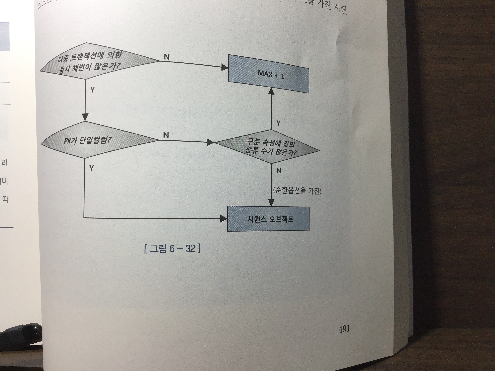

# [6장] DML 튜닝

### 6.1.1 DML 성능에 미치는 요인

- 인덱스,무결성 제약, 조건절, 서브쿼리, Redo, Undo로깅, Lock, 커밋

### 6.1.2 데이터베이스 Call과 성능

- Parse Call : SQL 파싱과 최적화를 수행하는 단계
- Execute Call : SQL 실행 단계 (SELECT문은 Fetch단계를 거친다.)
- Fetch Call : 결과집합을 전송하는 과정으로 SELECT 문에서만

Call의 발생위치에 따라서도 UserCall과 RecursiveCall로 나눌 수도 있다.

리커전콜의 경우 DBMS 내부에서 호출되는 콜로 UserCall보다 현저히 빠르게 응답한다.

---

6.1.3 Array Processing 활용

- 배치처럼 만번의 Insert콜을 한번으로 호출함으로써 (Array를 통해) 속도를 현저히 빠르게 만들 수도 있다.

---

### 6.1.4 인덱스 및 제약해제를 통한 대량 DML 튜닝

### 6.1.5 수정가능 조인 뷰

- 수정 가능 조인 뷰를 활용하면 참조 테이블과 두번 조인하는 비효율을 없앨 수 있다.
- 키보존 테이블 - 조인된 결과집합을 통해서도 중복 값 없이 유니크하게 식별이 가능한 테이블.

---

### 6.1.6 Merge 문의 활용

- DW에서 가장 흔히 발생하는 신규 트랜잭션 데이터를 반영함으로써 두 시스템간의 동기화작업이다.

```sql
merge into customer t using cutomer_delta s on(t.cust_id = s.cust_id)
when matched then update 
	set t.cust_nm = s.cust_nm, ...
when not matched then insert
	... values ... ;
```

- 소스테이블 기준으로 타겟 테이블과 레프트 아우터 방식으로 조인하여 업데이트하고 실패하면 인서트한다.
→ 이런 이유로 Merge를 UPSERT 라고 부르기도 한다.
- 한가지 중요한 사실은 MERGE문이 DELETE 절로 인한 조인에 성공한 데이터만 삭제할 수 있다는 점이다.
→ 소스테이블의 지워진 데이터를 타겟에서도 지우고 싶겠지만, 머지문이 딜리트절까지 그 역할을 못한다는 것이다. 소스에서 삭제된 데이터를 그냥 조인에 실패할 뿐이기 때문이다.
- 결국 DELETE 절은 조인에 성공한 데이터를 모두 업데이트하고 나서 결과값 DELETE WHERE 해야한다.

---

# Direct Path I/O 활용(***대량 데이터의 처리***)

<aside>
🔥 대량 데이터 처리시 버퍼캐시를 경유하는 I/O매커니즘이 성능을 떨어뜨릴 수 있다. 버퍼캐시 경유 없이이곧바로 데이터블록을 읽고 쓰는 direct path I/O 기능에 대해 알아본다.

</aside>

### 6.2.1 Direct Path I

1. 일반적으로 버퍼캐시를 이용해 데이터의 존재를 읽어보고 상대적으로 속도가 느린 I/O 콜을 줄이게 된다. 하지만 대량 데이터 처리시에는 오히려 버퍼캐시의 역할이 성능을 줄게 된다.(일반적으로 풀스캔 대량 데이터 처리는 블록 재사용가능성이 거의 없다.)
2. 기능이 작동하는 경우 
- 병령쿼리 풀스캔
- 병렬 DML 수행
- 다이렉트 패스 인서트
- Temp 세그먼트 블록 Reading&Insert
- 다이렉트 옵션지정 후 export 시
- nocache 옵션을 지정한 LOB 칼럼을 읽을 때

```sql
select /*+ full(t) parallel(t 4) */ * from big_table t;
select /*+ index_ffs(t big_table_x1) parallel_index(t big_table_x1 4) */ count(*) from big_table t;
```

- 다음과 같은 병렬도 지정시, 성능 4배가 아닌 수십배 빨라지게 되는데 이때 DP I/O 때문이다.

---

### 6.2.2 Direct Path Insert

- 일반적인 Insert 구문은 느린데, 이에 DPI/O 방식을 사용하면 훨씬 빠르게 대량 데이터를 인서트 가능하다.
- Freelist 참조 하지 않으며, HWM 바깥 영역에서 데이터를 순차적으로 입력하며
- 블록을 버퍼캐시에서 탐색하지 않는다.
- 버퍼캐시에 적재하지 않고, 데이터 파일에 직접 기록한다.
- Undo 로깅을 안하며, Redo는 안하게 할 수 있다.

---

### 6.2.3 병렬 DML

- UPDATE, DELETE는 기본적으로 Direct Path Write 방식이 불가능 하다. 따라서 병렬 DML으로 처리할 것인데, 병렬 DML에 항상 DPW 방식을 적용해 처리할 수 있다.

```sql
alter session enable parallel dml;
-- 병렬 DML 활성화
```

- 다음과 같이 CRUD 가능

```sql
insert /*+ parallel(c 4) */ into 고객 c
select /*+ full(o) parallel(o 4) */ * from 외부가입고객 o;

update /*+ full(c) parallel(c 4) */ 고객 c set 고객상태코드 = 'WD'
where 최종거래일시 < '20100101';

delete /*+ full(c) parallel(c 4) */ from 고객 c
where 탈퇴일시 < '20100101';
```

- 결국 병렬 DML도 dpw방식을 사용하므로 데이터를 입력/수정/삭제 시, Exclusive 모드 TM Lock이 걸린다는 사실을 꼭 기억하자. 따라서 ***트랜잭션이 빈번한 주간에 이 옵션을 사용하는 것은 절대 금물이다.***

---

# 6.3 파티션을 활용한 DML 튜닝

### 6.3.1 테이블 파티션

`파티셔닝` 테이블 또는 인덱스 데이터를 특정 칼럼(파티션키)값에 따라 별도 세그먼트에 나눠서 저장하는 것.

- 관리적측면 장점 : 파티션 단위백업, 추가, 삭제, 변경 → 가용성의 향상
- 성능적 측면 : 파티션 단위 조회 및 DML, 경합 또는 부하 분산

방법1)Range 파티션

- 일반적으로 날짜를 Range 하여 파티셔닝한다.

```sql
create table 주문 (...)
partition by range(주문일자)(
partition P2017_Q1 values less than('20170401')
,partition P2017_Q2 values less than ('20170701')
...
)
```

- 이러한 파티션 테이블의 성능향상의 원리는 다음과 같다.
- `하드파싱이나 실행시점에 조건절을 분석해서 읽지않아도 되는 파티션 세그먼트를 액세스에서 제외`
- 전체가 아닌 일부 세그먼트만 인덱스 (같은 풀스캔이라더도)

방법2) 해시파티션

- 파티션의 개수만 사용자가 결정하고 데이터를 분산하는 해시 알고리즘을 사용합니다.
- 파티션 키값을 해시함수에 입력해서 반환받은 값을 기준으로 데이터를 저장합니다.

```sql
create table 고객(...)
partition by hash(고객ID) partitions 4;
```

- 해시 알고리즘 특성상 등치(=)조건 또는 IN-List 조건으로 검색할때 파티셔닝 검색 작동된다.

방법3) 리스트 파티션

```sql
create table 매물(...)
partition by list(지역분류)(
	partition P_지역1 values ('서울')
	partition P_지역2 values ('경기')
	...
)
```

- 사용자가 정의한 그룹핑에 따라 데이터 분할 저장방식으로 순서와 상관없이 불연속적인 값의 목록에 의해 결정됩니다.

---

### 6.3.2 인덱스 파티션

- 파티션 테이블
    - 로컬파티션 인덱스 - 테이블 파티션과 1:1 대응 인덱스
    - 글로벌 파티션 인덱스 - 파티션을 테이블과 다르게 구성한 인덱스. (로컬과 달리, 오라클이 인덱스파티션을 자동관리 X)
- 비파티션 테이블

<aside>
🔥  Unique 인덱스를 파티셔닝 하려면 ***파티션 키가 모두 인덱스 구성 칼럼***이어야 한다.

</aside>

---

### 6.3.3 파티션을 활용한 대량 UPDATE 튜닝

- UPDATE문을 통해 대량의 데이터를 수정하려할 때, 변경 + 인덱스 까지 관리하려면 엄청난 시간이 소요될 것이며, 인덱스 전체를 재생성해야 하는 부담 또한 만만치 않다.
- 수정된 값을 갖는 임시 세그먼트를 만들어 원본 파티션과 바꿔치기하는 방식을 사용.

---

### 6.3.4 파티션을 활용한 대량 DELETE 튜닝

- 3.4와 마찬가지로 DELETE에도 많은 시간이 소요됩니다.
- DELETE가 상대적으로 느린이유 : 테이블레코드 삭제 → 레코드삭제에대한 UNDO → REDO →인덱스 레코드 삭제 → 인덱스레코드에 대한 UNDO → REDO → 2번의 UNDO에 대한 REDO

```sql
alter table 거래 drop partition p201412;
alter table 거래 drop partition for('20141201');
```

---

### 6.3.5 파티션을 이용한 대량 INSERT 튜닝

```sql
-- nologging 모드전환
alter table target_t modify partition p_201712 nologging;
-- 인덱스파티션 Unusable 모드 전환
alter index target_t_x01 modify partition p_201712 unusable;
-- Data 삽입
insert /*+ append */ into target_t
select * from source_t where dt between '20171201' and '20171231';
-- 인덱스 파티션 재생성
alter index target_t_x01 rebuild partition p_201712 nologging;
-- logging 모드로 재전환
alter table target_t modify partition p_201712 logging;
alter index target_t_x01 modify partition p_201712 logging;
```

---

# 6.4 Lock과 트랜잭션 동시성 제어

`Lock`은 데이터베이스의 특징을 결정짓는 가장 핵심적인 메커니즘입니다.

- 이번장에서 Lock과 트랜잭션에 대해 공부합니다

---

### 6.4.1 오라클 Lock

- 많은 락이 존재합니다. (DML Lock, DDL Lock, 래치, 버퍼락, 라이브러리 락/핀 등), 이 중 DML Lock 에 대해 심도 있게 탐구합니다.
- `DML Lock` 다중 트랜잭션이 동시에 액세스 하는 사용자 데이터의 무결성을 보호해주는 락으로 테이블락과 로우락이 있습니다.
1. DML 로우 Lock 
- 두개의 동시 트랜잭션이 같은 로우를 변경하는 것을 방지합니다. ***하나의 변경은 로우락의 선 실행을 요구합니다.***
    
    -로우Lock은 배타적모드로 UPDATE ,DELETE , INSERT(Unique 인덱스 필요) 트랜잭션간 경합되어질 수 없습니다.
    
    -반면에 MVCC모델인 오라클에서는 DML과 SELECT문간의 경합이 발생하지 않습니다.
    
    -따라서 Lock을 짧은 수준으로 유지하도록 커밋시점을 조절하는 것이, Lock튜닝 입니다.(성능 최대화)
    
2. DML Table Lock
- 로우락 이전에 테이블락을 먼저 설정합니다. 정확하게는 ***해당 테이블에서 어떤 작업을 수행하는지에 대한 푯말***  
- 테이블락에는 여러가지 모드가 있고, 어떤 모드냐에 따른 후행 트랜잭션의 작업여부가 결정됩니다.(무조건적인 후행 트랜잭션의 거부가 아닙니다.)
- 표 6-2 참조

| 표 6-2 | Null | RS | RX | S | SRX | X |
| --- | --- | --- | --- | --- | --- | --- |
| Null | O | O | O | O | O | O |
| RS | O | O | O | O | O |  |
| RX | O | O | O |  |  |  |
| S | O | O |  | O |  |  |
| SRX | O | O |  |  |  |  |
| X | O |  |  |  |  |  |

---

### Lock을 푸는 열쇠, 커밋

- 블록킹 - 락으로 인한 후행 트랜잭션의 멈춰있는 상태
- 교착상태 - 두 트랜잭션이 각각 특정 리소스에 락을 설정한 상태에서 맞은편 트랜잭션이 설정한 리소스에 락을 설정하려는 상태

---

### 6.4.2 트랜잭션 동시성 제어

- [ ]  우리는 비관적 동시성 제어와 낙관적 동시성 제어에 대해 공부합니다.
- 비관적 동시성 제어 : 사용자가 동시에 데이터를 수정할 것을 가정한 상태의 동시성
- `for update 옵션(nowait, wait 3 등)`을 통해 동시성 제공
- 낙관적 동시성 제어 : 사용자가 다른 순간에 데이터를 수정할것으로 가정한 상태의 동시성
- 최후의 조건절에 기데이터가 변경되엇는지 비교하는 조건절 삽입

<aside>
🔥 동시성 향상하고자 할때 SQL 튜닝은 기본이다.

</aside>

- 불필요하게 Lock을 오래 유지 하지 않고, 트랜잭션의 원자성을 보장하는 범위내에서 가급적 빨리 커밋해야한다.

---

### 6.4.3 채번 방식에 따른 Insert 성능 비교

- 신규 데이터 입력시 PK 중복 방지를 위한 `채번` 의 선행이 필요한데, 방식 3가지를 공부할 것이다.
1. 채번 테이블
- 각 테이블 식별자의 단일 컬럼 일련번호, 순번등을 채번하기 위해 별도의 테이블을 관리하는 방식
- 범용성이 좋고, 결번방지, 복합컬럼에도 사용가능 , 채번함수만으로 중복레코드 방지
- 단점 : 성능이 안좋다.(Low Lock 경합)
→ Insert가 많은 테이블의 경우 사용하기 힘들다.
2. 시퀀스 오브젝트
- 높은 성능을 제공, 
- 그러나 결국 시퀀스 오브젝트도 테이블으로 Lock 메커니즘이 작동한다.
- 기본적으로 PK가 단일 칼럼일 때만 사용 가능하다.
- 결번의 생성가능(트랜잭션 롤백이나 시퀀스가 캐시에서 밀려나는 경우)
3. MAX + 1 조회
- 최종 일련번호를 조회한 후, 그 조회한 일련번호의 +1 하여 Insert 하는 방식.
- 성능이 빠르며, 별도의 테이블이 없다. 
- 중복에 대한 세밀한 예외처리가 필요하며, 다중 트랜잭션에 의한 동시 채번이 심하면 시퀀스보다 성능이 나빠질 수 있다.(Low Lock 경합) → PK가 복합컬럼이면 구분 속성값 별로 채번이 분산되어 Lock락이 현저히 줄어든다.



---

<aside>
🔥 구분속성과 함께 뒤쪽에 순번 대신 입력일시를 두는 방식으로 PK구조를 설계하게 되면,
채번 또는 Insert시 생기는 Lock 이슈를 거의 해결 할 수 있다.

</aside>

### 인덱스 블록 경합

- Insert 성능이 너무 빨라도 문제가 될 수 있다. 특히 Max+1의 경우에 많이 볼 수 있다.
- 입력일시나 Max+1처럼 단일 방향으로 증가하는 `right growing 인덱스` 는 맨 우측 블록으로만 데이터가 입력된다. 같은 블록을 갱신하려는 프로세스간 버퍼 Lock 이 발생할 수 있다.
→ 인덱스 블록 경합을 해소하는 가장 일반적인 방법은 인덱스를 `해시 파티셔닝` 하는 것이다.
→ 증가하는 같은 블록의 인덱스도 해시를 통해 다른 블록으로 분산 될 수 있다.

---